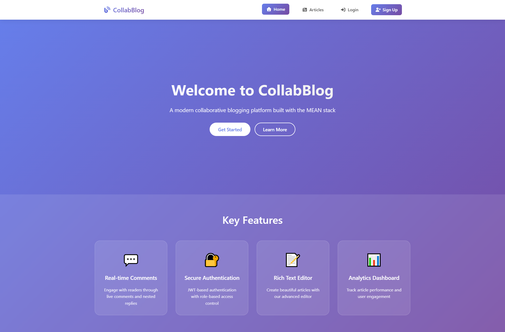

# 🚀 CollabBlog - MEAN Stack Collaborative Blogging Platform

## 📋 Project Overview

CollabBlog is a modern, full-stack collaborative blogging platform built with the MEAN stack (MongoDB, Express.js, Angular, Node.js). It features role-based access control, real-time comments, and an intuitive admin dashboard with analytics.

---

## 📸 Application Screenshots

### Home Page

<br><br>

### Admin Dashboard

<br><br>

<br><br>

---

##  How to Install and Run the Project

### Prerequisites

-   **Node.js** (v18+)
-   **MongoDB** (v5+) - Ensure it's running locally or accessible via a connection string.
-   **Angular CLI** - Install globally: `npm install -g @angular/cli`
-   **Git**

### Installation Steps

1.  **Clone the repository:**
    ```bash
    git clone [<your-repository-url>](https://github.com/wissemgo/CollabBlog)
    cd collab-blog
    ```

2.  **Install dependencies for Backend and Frontend:**
    ```bash
    # Install backend dependencies
    cd backend
    npm install

    # Install frontend dependencies
    cd ../frontend
    npm install
    ```

3.  **Backend Environment Configuration:**
    *   Navigate to the `backend` directory: `cd backend`
    *   Create a `.env` file by copying the example: `cp .env.example .env`
    *   Edit the `.env` file and set your environment variables. Ensure `MONGODB_URI`, `JWT_SECRET`, `REFRESH_TOKEN_SECRET`, and `CORS_ORIGIN` are correctly configured.
        ```env
        NODE_ENV=development
        PORT=3000

        # MongoDB
        MONGODB_URI=mongodb://localhost:27017/collab-blog # Adjust if your MongoDB is elsewhere

        # JWT Secrets
        JWT_SECRET=your-super-secret-jwt-key-here # IMPORTANT: Change this to a strong, unique secret
        REFRESH_TOKEN_SECRET=your-refresh-token-secret-here # IMPORTANT: Change this to a strong, unique secret
        JWT_EXPIRES_IN=15m
        REFRESH_TOKEN_EXPIRES_IN=7d

        # CORS
        CORS_ORIGIN=http://localhost:4200 # Ensure this matches your frontend URL
        ```

4.  **Seed the Database (Optional, but Recommended for initial setup):**
    *   To populate your local MongoDB with sample users, articles, and comments, you can run a seeding script. (Instructions for creating a `seed.ts` script will be provided separately or can be found in a dedicated `SEEDING.md` file if available).

### Running the Application

1.  **Start the Backend Server:**
    *   Open a new terminal.
    *   Navigate to the `backend` directory: `cd backend`
    *   Run the development server: `npm run dev`
    *   You should see output indicating the server is running on `http://localhost:3000`.

2.  **Start the Frontend Application:**
    *   Open another new terminal.
    *   Navigate to the `frontend` directory: `cd frontend`
    *   Run the Angular development server: `npm start`
    *   This will open the application in your browser, usually at `http://localhost:4200`.

### Accessing the Application

-   **Frontend:** `http://localhost:4200`
-   **Backend API (base URL):** `http://localhost:3000`
-   **API Documentation (Swagger UI):** `http://localhost:3000/api-docs`

---

## 🏗️ Project Structure

The project is organized into two main parts: `backend` (Node.js/Express.js) and `frontend` (Angular).

### Backend (`backend/`)

The backend is built with Node.js and Express.js, using TypeScript for type safety.

```
backend/
├── src/
│   ├── config/        # Database, Socket.io, and other configurations
│   ├── controllers/   # Business logic for handling requests
│   ├── middleware/    # Authentication, error handling, etc.
│   ├── models/        # Mongoose schemas and models (defines database structure)
│   ├── routes/        # API endpoints definitions
│   ├── types/         # Custom TypeScript type definitions
│   ├── utils/         # Utility functions (e.g., JWT generation)
│   └── server.ts      # Main Express server setup and entry point
├── .env               # Environment variables (local configuration)
├── .env.example       # Example environment variables
├── package.json       # Backend dependencies and scripts
└── tsconfig.json      # TypeScript configuration
```

### Frontend (`frontend/`)

The frontend is a Single Page Application (SPA) developed with Angular.

```
frontend/
├── src/
│   ├── app/
│   │   ├── components/  # Reusable UI components (e.g., home, admin, navbar, articles, auth)
│   │   ├── services/    # Angular services for API interaction and state management
│   │   ├── guards/      # Route protection (authentication, role-based access)
│   │   ├── interceptors/ # HTTP interceptors for JWT, error handling
│   │   ├── models/      # TypeScript interfaces matching backend models
│   │   ├── app.config.ts # Angular application configuration
│   │   ├── app.routes.ts # Angular routing definitions
│   │   └── app.ts       # Root Angular component
│   ├── assets/         # Static assets like images (e.g., default-avatar.png)
│   ├── environments/   # Environment-specific configurations (e.g., API URLs)
│   ├── index.html      # Main HTML file
│   └── main.ts         # Angular application bootstrapping
├── angular.json       # Angular CLI configuration
├── package.json       # Frontend dependencies and scripts
└── tsconfig.json      # TypeScript configuration
```

---

## 💡 Technical Choices Made

### Full-Stack Technologies
-   **MongoDB**: NoSQL database for flexible data storage.
-   **Express.js**: Fast, unopinionated, minimalist web framework for Node.js.
-   **Angular**: Robust framework for building scalable client-side applications.
-   **Node.js**: JavaScript runtime for server-side logic.

### Authentication & Authorization
-   **JWT (JSON Web Tokens) + Refresh Tokens**: Implemented for secure, stateless authentication with token refreshing to enhance security and user experience.
-   **`bcryptjs`**: Used for strong password hashing to protect sensitive user data.
-   **Role-Based Access Control (RBAC)**: Fine-grained control over user permissions using `UserRole` enum and middleware on the backend, and route guards on the frontend.

### Real-time Communication
-   **Socket.IO**: Integrated for real-time features such as live comments, typing indicators, and notifications, providing an interactive user experience.

### API Design & Documentation
-   **RESTful API**: Clear and consistent API design for resource manipulation.
-   **Swagger/OpenAPI**: Used for comprehensive API documentation, making it easy to understand and interact with the backend endpoints.

### Frontend Architecture
-   **Standalone Components**: Modern Angular approach for building modular and reusable UI elements.
-   **Reactive Programming (RxJS)**: Leveraged for asynchronous operations and state management, promoting a declarative and efficient codebase.
-   **HTTP Interceptors**: Centralized handling of cross-cutting concerns like JWT attachment and global error handling.
-   **Lazy Loading**: Routes are lazy-loaded to optimize initial bundle size and improve application load times.
-   **`DomSanitizer`**: Used to safely render HTML content (e.g., article content) from the backend, preventing XSS vulnerabilities.

### Security & Best Practices
-   **`helmet`**: Configured to set various HTTP headers for enhanced security.
-   **`cors`**: Properly configured to manage cross-origin requests.
-   **`express-rate-limit`**: Implemented to protect against brute-force attacks and abuse.
-   **Input Validation**: Extensive validation on both frontend and backend to ensure data integrity and prevent common vulnerabilities.

---


**Built with ❤️ using the MEAN Stack (MongoDB, Express.js, Angular, Node.js)**
